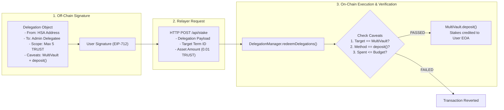

# Getting Started with Delegated Execution on Intuition (ERC-7710 & ERC-7702)

Welcome to the **Intuition Delegation Framework Guide**. This document provides a high-level, visual overview of how delegated execution works on the Intuition Protocol before diving into the step-by-step code implementation.

---

## 1. What is Delegated Execution?

In standard Web3 applications, every single on-chain action requires the user to manually confirm a MetaMask popup and pay gas fees. For high-frequency social protocols like **Intuition** - where users constantly interact with knowledge graphs by creating claims, supporting statements, or opposing triples - this constant friction causes severe user drop-off.

**Delegated Execution** solves this by letting users delegate specific, restricted permissions to an automated agent or backend relayer.

### Core Concepts & Components

| Component | Description |
| :--- | :--- |
| **EOA (Externally Owned Account)** | The user's standard MetaMask wallet (`0xUser...`). |
| **ERC-7702 (Hybrid Smart Account / HSA)** | A protocol upgrade allowing the user's EOA to temporarily act as a Smart Account deterministically without changing their wallet address or moving their assets. |
| **ERC-7710 (Delegation Framework)** | The standard for creating, signing, validating, and redeeming scoped execution authority off-chain. |
| **Caveat Enforcers** | Smart contracts that enforce strict boundaries on what the delegatee can do (e.g., max TRUST budget, allowed target contracts, allowed function selectors, call limits, and expiration timestamps). |
| **Backend Relayer** | An application server holding an Admin Wallet key (`0xAdmin...`). It receives user delegations and broadcasts transactions to pay gas on their behalf. |
| **DelegationManager** | The core framework contract on Intuition (`0xdb9B1e94B5b69Df7e401DDbedE43491141047dB3`) that validates enforcers and executes delegated actions. |
| **MultiVault** | Intuition's main protocol contract (`0x6E35cF57A41fA15eA0EaE9C33e751b01A784Fe7e`) managing Atoms, Triples, and staking vaults. |

---

## 2. Visual Architecture & Flow Diagrams

### Diagram 1: System Architecture

The following diagram illustrates how the User's EOA, the Hybrid Smart Account (HSA), the Backend Relayer, the DelegationManager, and the Intuition MultiVault connect:

```mermaid
graph TD
    subgraph User Domain
        EOA["User EOA (MetaMask Wallet)"]
        HSA["Hybrid Smart Account (ERC-7702 HSA)"]
        Storage["Browser LocalStorage (Signed Delegation)"]
    end

    subgraph Relayer Domain
        RelayerAPI["Next.js Backend Relayer (/api/stake)"]
        AdminKey["Admin Wallet (Pays Gas)"]
    end

    subgraph Intuition Protocol Domain
        DelManager["DelegationManager (0xdb9B...)"]
        Caveats["Caveat Enforcers (AllowedTargets, AllowedMethods, Budget)"]
        MultiVault["Intuition MultiVault (0x6E35...)"]
    end

    EOA -->|1. Upgrades & Funds| HSA
    EOA -->|2. Signs Off-Chain Delegation| Storage
    Storage -->|3. Passes Signed Payload| RelayerAPI
    AdminKey -->|4. Signs & Broadcasts Tx| RelayerAPI
    RelayerAPI -->|5. redeemDelegations()| DelManager
    DelManager -->|6. Validates Scope & Rules| Caveats
    Caveats -->|7. Executes Deposit| MultiVault
```

---

## Diagram 2: User Lifecycle Flow

This sequence shows the end-to-end user journey: setup, 1-click staking, and on-chain revocation.

```mermaid
sequenceDiagram
    autonumber
    actor User as User (EOA)
    participant App as Frontend UI
    participant HSA as Hybrid Smart Account
    participant Relayer as Backend Relayer (/api/stake)
    participant DM as DelegationManager
    participant MV as Intuition MultiVault

    rect rgb(20, 30, 48)
        note over User, App: Stage 1: Setup & Delegation
        User->>App: Click "Enable 1-Click Staking" (Set Budget: 5 TRUST)
        App->>HSA: Deploy HSA (if new) & Fund HSA with 5 TRUST
        App->>MV: Approve MultiVault to spend HSA funds
        App->>User: Request Off-Chain Delegation Signature (EIP-712)
        User-->>App: Signed Delegation Payload
        App->>App: Store Delegation in localStorage
    end

    rect rgb(20, 48, 30)
        note over User, MV: Stage 2: 1-Click Staking Execution
        User->>App: Click "Support" on Claim Feed
        App->>Relayer: POST /api/stake (Delegation Payload + TermID)
        Relayer->>DM: redeemDelegations(Delegation, ExecutionData)
        DM->>DM: Validate Caveats (AllowedTargets, AllowedMethods, Budget)
        DM->>MV: MultiVault.deposit(UserAddress, TermID, CurveID, MinShares)
        MV-->>Relayer: Transaction Confirmed (Gas paid by Relayer)
        Relayer-->>App: Return Tx Hash (Success)
        App-->>User: Instant UI Update (0 Popups!)
    end

    rect rgb(48, 20, 20)
        note over User, DM: Stage 3: Revocation
        User->>App: Click "Disable 1-Click"
        App->>MV: Send approve(smartAccount, NONE)
        App->>App: Clear Delegation from localStorage
    end
```



---

## Diagram 3: Data & Authority Flow

This diagram details how authority and data move during a 1-Click Stake operation:



---

## 3. Try the Demo DApp

You can test the full implementation locally:

```bash
# 1. Clone the repository
git clone https://github.com/Intellihackz/intuition-delegation-tutorial-claimstream.git
cd intuition-delegation-tutorial-claimstream

# 2. Install dependencies
npm install

# 3. Configure environment variables (.env.local)
# Set your Admin wallet private key (used as the delegatee/relayer)
ADMIN_PRIVATE_KEY=0xYourAdminWalletPrivateKeyHere

# 4. Start development server
npm run dev
```

Open [http://localhost:3000](http://localhost:3000) in your browser:
1. Connect your MetaMask wallet (will automatically prompt to switch to Intuition Mainnet).
2. Enter a budget (e.g. `1` TRUST) and click **Enable 1-Click Staking**.
3. Sign the delegation popup.
4. Click **Support** or **Oppose** on any claim in the feed to experience 0-popup 1-click staking!

---

## 4. Step-by-Step Developer Tutorial

Ready to build this from scratch in your own project? 

**[Read the Full Code Tutorial (TUTORIAL.md)](./TUTORIAL.md)** for a complete, step-by-step code walkthrough of the entire DApp!
