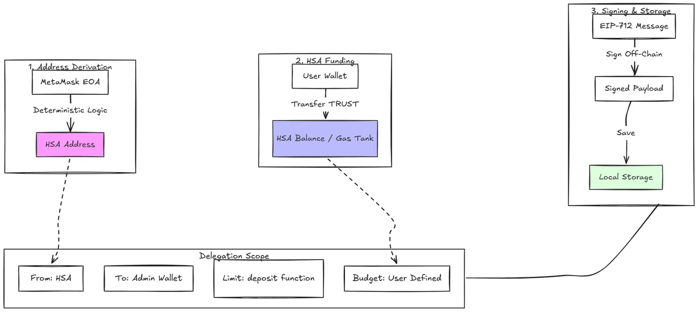
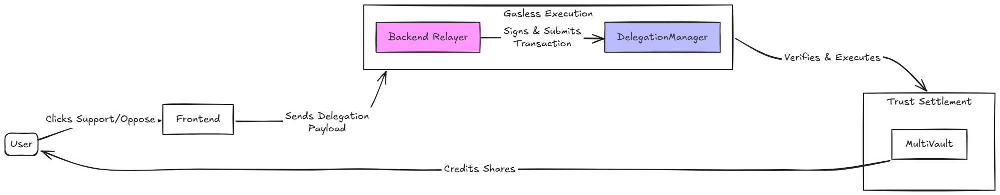

# Building a Claim Feed DApp on Intuition (ERC-7710)

Welcome! In this tutorial, we're going to build a fully functional **Claim Feed** on the Intuition Protocol.

By the end, you'll have a production-ready Next.js application where users can connect their MetaMask wallet, browse a live feed of claims, and support or oppose them - all without a single MetaMask popup per action.

## Table of Contents

* [Prerequisites](#prerequisites)
* [What We're Building](#what-were-building)
* [How This Will Work](#how-this-will-work)
* [Project Setup](#project-setup)
* [Wallet Connection](#wallet-connection)
* [The Upgrade Account Section](#the-upgrade-account-section)
* [The Claim Feed UI](#the-claim-feed-ui)
* [Integrating Delegation Redemption](#integrating-delegation-redemption)

---

## Prerequisites

Before we dive in, make sure you have:

* **Node.js 18+**
* **MetaMask** browser extension installed
* **A secondary "Admin" wallet** - You need the private key of a throwaway wallet that will pay gas on behalf of your users. Never use your main wallet for this.
* **Basic React/TypeScript knowledge** - Comfortable with hooks, state, and components

---

## What We're Building

Here is exactly what our Claim Feed will do by the end of this tutorial:

### Frontend Features

* **Intuition Network Connection** - Connect MetaMask and automatically switch to the Intuition Mainnet
* **Delegated Staking Setup Panel** - Let users deploy a Hybrid Smart Account and sign a scoped delegation in one flow
* **Daily Allowance Meter** - A live display of how much of today's delegated spend cap is left and when it resets, plus the HSA balance and a block-explorer link
* **Infinite Scroll Feed** - A live, paginated feed of all claims on the protocol, with Support and Oppose buttons
* **Delegation Revocation** - Let users revoke their delegated staking permissions at any time

### Backend Features

* **Gas Relayer API** - A secure Next.js API route that holds our Admin wallet's private key and executes delegated stakes on behalf of users

---

## How This Will Work

In standard Web3 applications, every single on-chain action requires the user to manually confirm a MetaMask popup and pay gas fees. For high-frequency social protocols like Intuition, where users constantly interact with knowledge graphs by creating claims, supporting statements, or opposing triples, this constant friction causes severe user drop-off. Delegated execution solves this UX bottleneck by allowing users to delegate specific, restricted permissions to an automated agent or backend relayer.

To understand how this architecture operates, it is helpful to explore the core protocol building blocks that make seamless delegated execution possible.

### Core Concepts

* **[Externally Owned Account (EOA)](https://ethereum.org/en/developers/docs/accounts/)**: The foundational layer of user identity. This is the standard wallet address managed directly by browser extensions like MetaMask. In traditional web3 applications, an EOA must sign every individual transaction directly on-chain, limiting automation and forcing users to approve every gas fee manually.

* **[ERC-7702](https://eips.ethereum.org/EIPS/eip-7702) (Hybrid Smart Accounts / HSA)**: A protocol upgrade introducing code execution capabilities directly to the user's existing EOA. An HSA upgrades the user's EOA into a smart account deterministically, giving it programmable account capabilities without forcing the user to transfer funds to a new address or deploy an entirely separate smart contract wallet. Because the HSA address matches the user's EOA address, all assets and identities remain unified.

* **[ERC-7710](https://eips.ethereum.org/EIPS/eip-7710) (Delegation Framework)**: A standardized protocol for creating, signing, and redeeming execution authority off-chain. Instead of giving a third party full access to a wallet, ERC-7710 allows the user to sign an off-chain EIP-712 payload that grants another address, known as the delegatee, permission to execute specific actions on their behalf.

* **[Caveat Enforcers](https://docs.metamask.io/smart-accounts-kit/concepts/delegation/caveat-enforcers/)**: Smart contracts that enforce strict cryptographic constraints on the delegated payload. In the context of Intuition, caveats ensure that the delegatee can only call the MultiVault contract, can only execute the deposit function, can only spend up to a per-day TRUST cap that refills automatically, and can only execute a limited number of calls before the session key expires.

* **Backend Relayer**: A secure application server holding an Admin Wallet private key. When a user clicks Support or Oppose on the claim feed, the frontend forwards the signed delegation payload to the relayer. The relayer then broadcasts the transaction to the blockchain, paying the gas fees so the user experiences zero transaction popups.

* **[DelegationManager Contract](https://docs.metamask.io/smart-accounts-kit/concepts/delegation/delegation-manager/)**: The central verification engine on Intuition. It receives the delegation payload from the relayer, verifies the user's signature, passes the transaction parameters through every attached Caveat Enforcer, and only forwards the call to the destination contract if every rule condition passes.

* **[Intuition MultiVault Contract](https://www.docs.intuition.systems/docs/intuition-smart-contracts/multivault)**: The core smart contract protocol that manages Atoms, Triples, and bonding curve vaults on Intuition. When the DelegationManager validates a delegated execution, it calls deposit on the MultiVault, crediting the resulting vault shares directly to the user's address.

To see how these concepts connect during setup and execution, let's explore the delegation flow and the user flow.

### Delegation Flow

Here is how delegation permissions are derived, funded, signed, and stored:

* **HSA Address Derivation**: The application derives the user's deterministic Hybrid Smart Account address directly from their connected MetaMask wallet.

* **HSA Funding**: The user transfers TRUST into their HSA address (for example, 5 TRUST). This balance acts as their delegated staking gas tank; the per-day cap below controls how fast it can be spent.

* **User Signs Delegation**: The user signs an off-chain EIP-712 delegation message where:
  * **from**: The user's HSA address
  * **to**: Our Admin Wallet address (`ADMIN_DELEGATEE`)
  * **caveats**: Restricted strictly to calling `deposit()` on the Intuition MultiVault, up to a user-defined TRUST cap **per rolling 24h window** that resets automatically.

* **Off-Chain Storage**: The signed delegation payload is saved in local storage without incurring any transaction gas fees for the user.




### User Flow

Once delegation is configured, here is how user interactions, relayer dispatch, and on-chain settlement execute seamlessly:

* **User Interaction**: The user clicks Support or Oppose on the claim feed with zero MetaMask popups.

* **Relayer Dispatch**: The frontend forwards the saved delegation payload to our backend `/api/stake` route.

* **Admin Wallet Execution**: Our backend uses our Admin Wallet private key to submit `DelegationManager.redeemDelegations()` on-chain, covering the transaction gas fee on behalf of the user.

* **Caveat Verification and Settlement**: The DelegationManager contract verifies the user's cryptographic signature, enforces all attached caveats, and executes the deposit on the MultiVault contract, crediting vault shares directly to the user's account.



---

## Project Setup

Let's initialize our Next.js project and install everything we need.

```bash
npx create-next-app@latest intuition-claim-feed
cd intuition-claim-feed
npm install viem @metamask/smart-accounts-kit @0xintuition/sdk @0xintuition/graphql @0xintuition/protocol
```

### Environment Variables

Create a `.env.local` file in the root of your project:

```env
# The private key of your backend Admin Wallet
# This wallet pays gas for delegated stakes. Use a throwaway wallet.
ADMIN_PRIVATE_KEY=0xYourAdminWalletPrivateKeyHere

# The public address derived from the key above. The frontend needs this to
# know who it's delegating to — if it doesn't match ADMIN_PRIVATE_KEY, the
# relayer won't be able to redeem the delegations you create.
NEXT_PUBLIC_ADMIN_ADDRESS=0xYourAdminWalletAddressHere
```

> **Security Note:** The `ADMIN_PRIVATE_KEY` must never be exposed to the frontend. We will only access it inside Next.js API routes which run exclusively on the server.

### Centralized Constants

Create `src/lib/constants.ts`. Keeping all contract addresses in one place means we only have to update them once if they ever change.

```ts
// src/lib/constants.ts
import { type Address } from 'viem';

// The Intuition Protocol MultiVault on Mainnet
export const MULTIVAULT: Address = '0x6E35cF57A41fA15eA0EaE9C33e751b01A784Fe7e';

// The MetaMask Delegation Manager on Intuition Mainnet
export const DELEGATION_MANAGER: Address = '0xdb9B1e94B5b69Df7e401DDbedE43491141047dB3';

// The function signature for staking in the MultiVault
export const DEPOSIT_SIG = 'deposit(address,bytes32,uint256,uint256)';

// Byte offsets for pinning specific arguments inside the deposit calldata
export const DEPOSIT_OFFSET = {
  receiver: 4,   // First argument after the 4-byte function selector
};

// The rolling window the delegated staking cap is measured over. The
// NativeTokenPeriodTransfer caveat lets the relayer spend up to the chosen
// amount per window, then refills automatically on the next one.
export const BUDGET_PERIOD_SECONDS = 86_400; // 1 day
```

> The real `src/lib/constants.ts` in the repo also exports `multiVaultAbi` and an `ApprovalType` map used by the hook below - grab it from the repo so the imports resolve.

---

## Wallet Connection

Before we can do anything onchain, we need to connect to the user's MetaMask wallet and make sure they are on the correct network.

### 1. Define the Chain

Create `src/lib/chains.ts`. This tells `viem` everything it needs to know about the Intuition network.

```ts
// src/lib/chains.ts
import { defineChain } from 'viem';

export const intuitionMainnet = defineChain({
  id: 1155,
  name: 'Intuition',
  nativeCurrency: { decimals: 18, name: 'Intuition', symbol: 'TRUST' },
  rpcUrls: {
    default: { http: ['https://rpc.intuition.systems/http'] },
  },
  blockExplorers: {
    default: { name: 'Blockscout', url: 'https://explorer.intuition.systems' },
  },
});
```

### 2. The Wallet Context

Create `src/lib/WalletContext.tsx`. This context does three important things:

* It provides a `viem` `WalletClient` (for sending transactions) and `PublicClient` (for reading from the chain) to every component in the app.
* It handles the MetaMask connection flow via `window.ethereum`.
* It includes an `ensureChain` helper that switches the user to the Intuition network before any transaction, so we never get wrong-network reverts.

<details>
<summary>View <code>src/lib/WalletContext.tsx</code></summary>

```tsx
// src/lib/WalletContext.tsx
'use client';

import { createContext, useContext, useState, useEffect, ReactNode } from 'react';
import { createWalletClient, custom, createPublicClient, http, WalletClient, PublicClient, Address } from 'viem';
import { intuitionMainnet } from './chains';

interface WalletContextType {
  address: Address | null;
  walletClient: WalletClient | null;
  publicClient: PublicClient;
  connect: () => Promise<void>;
  disconnect: () => void;
  ensureChain: () => Promise<void>;
}

// We create one shared PublicClient for the whole app.
// This is used for read-only operations like fetching balances or simulating transactions.
const publicClient = createPublicClient({
  chain: intuitionMainnet,
  transport: http(),
}) as PublicClient;

const WalletContext = createContext<WalletContextType | null>(null);

// This helper switches the user to Intuition Mainnet.
// If the chain hasn't been added to MetaMask yet (error 4902), it adds it first.
async function switchToIntuition(client: WalletClient) {
  try {
    await client.switchChain({ id: intuitionMainnet.id });
  } catch (err: any) {
    const code = err?.code ?? err?.cause?.code;
    if (code === 4902 || /Unrecognized chain/i.test(err?.message ?? '')) {
      await client.addChain({ chain: intuitionMainnet });
      await client.switchChain({ id: intuitionMainnet.id });
    } else {
      throw err;
    }
  }
}

export function WalletProvider({ children }: { children: ReactNode }) {
  const [address, setAddress] = useState<Address | null>(null);
  const [walletClient, setWalletClient] = useState<WalletClient | null>(null);

  const connect = async () => {
    if (typeof window === 'undefined' || !(window as any).ethereum) {
      alert('Please install MetaMask!');
      return;
    }
    try {
      const client = createWalletClient({
        chain: intuitionMainnet,
        transport: custom((window as any).ethereum),
      });
      const [addr] = await client.requestAddresses();

      // We create a new client bound to the user's address.
      // This prevents "Could not find an Account" errors in viem when signing.
      const boundClient = createWalletClient({
        account: addr,
        chain: intuitionMainnet,
        transport: custom((window as any).ethereum),
      });

      await switchToIntuition(client);
      setAddress(addr);
      setWalletClient(boundClient as WalletClient);
    } catch (e) {
      console.error(e);
    }
  };

  // Checks the chain right before any transaction - in case the user switched networks manually
  const ensureChain = async () => {
    if (!walletClient) throw new Error('Wallet not connected');
    await switchToIntuition(walletClient);
  };

  const disconnect = () => {
    setAddress(null);
    setWalletClient(null);
  };

  // Keep the app in sync if the user changes accounts in MetaMask
  useEffect(() => {
    if (typeof window === 'undefined' || !(window as any).ethereum) return;
    const handleAccountsChanged = (accounts: string[]) => {
      if (accounts.length > 0) setAddress(accounts[0] as Address);
      else disconnect();
    };
    (window as any).ethereum.on('accountsChanged', handleAccountsChanged);
    return () => (window as any).ethereum.removeListener('accountsChanged', handleAccountsChanged);
  }, []);

  return (
    <WalletContext.Provider value={{ address, walletClient, publicClient, connect, disconnect, ensureChain }}>
      {children}
    </WalletContext.Provider>
  );
}

export const useWallet = () => {
  const context = useContext(WalletContext);
  if (!context) throw new Error('useWallet must be used within WalletProvider');
  return context;
};
```
</details>

### 3. Wrap the App in the Provider

Open `src/app/layout.tsx` and wrap the app in `<WalletProvider>` so every component has access to the wallet context.

```tsx
// src/app/layout.tsx
import './globals.css';
import { WalletProvider } from '@/lib/WalletContext';

export default function RootLayout({ children }: { children: React.ReactNode }) {
  return (
    <html lang="en">
      <body className="bg-black text-white min-h-screen font-mono">
        <WalletProvider>
          {children}
        </WalletProvider>
      </body>
    </html>
  );
}
```

### 4. The Connect Button

Create `src/components/ConnectButton.tsx`. This is a simple component that shows a truncated wallet address when connected, or a Connect button when not.

```tsx
// src/components/ConnectButton.tsx
'use client';
import { useWallet } from '@/lib/WalletContext';

export function ConnectButton() {
  const { address, connect, disconnect } = useWallet();

  if (address) {
    return (
      <button
        onClick={disconnect}
        className="px-4 py-2 border border-white/20 text-white/70 font-mono text-sm hover:border-white hover:text-white transition-all"
      >
        {address.slice(0, 6)}...{address.slice(-4)}
      </button>
    );
  }

  return (
    <button
      onClick={connect}
      className="px-4 py-2 bg-white text-black font-bold uppercase tracking-widest text-sm hover:bg-white/90 transition-all"
    >
      Connect Wallet
    </button>
  );
}
```


---

## The Upgrade Account Section

This is the core of the tutorial. We will build both the UI and the delegation logic together.

Before writing code, let's understand what happens under the hood when a user clicks "Enable Delegated Staking":

1. **Initialize the HSA** - We calculate the user's deterministic Hybrid Smart Account address from their wallet address. The HSA does not need to be deployed yet.
2. **Deploy the HSA** - If it hasn't been deployed on-chain before, we deploy it. This is a one-time step.
3. **Fund the HSA** - We transfer TRUST from the user's main wallet to the HSA. This is the total staking balance; the per-day cap in the delegation limits how fast the relayer can draw it down. The user can top up the HSA address anytime to extend the runway.
4. **Approve the MultiVault** - The user's EOA calls `multiVault.approve(HSA, ApprovalType.DEPOSIT)`. This authorizes the HSA to submit `deposit(receiver = EOA, ...)` calls so the resulting vault shares are credited to the user's own address. The MultiVault rejects deposits where `receiver != sender` without this approval - it never moves the HSA's funds itself; the HSA sends the deposit and the MultiVault just allows the EOA as the beneficiary.
5. **Create and Sign the Delegation** - We build the scoped delegation object with all its Caveat Enforcers - including a per-day spend cap - and ask the user to sign it with MetaMask.
6. **Save the Delegation** - We save the signed delegation to `localStorage` so the feed can use it for future delegated actions without asking the user to sign again.

### The Upgrade Account UI

Create `src/components/UpgradeAccount.tsx`. This component renders:

* An "Enable Delegated Staking" flow with a **daily limit** and **fund HSA** input when no delegation exists
* When a delegation is active: the full HSA address (with copy and block-explorer links), the live HSA balance, a "resets in..." daily-allowance meter, and a "Disable" button

```tsx
// src/components/UpgradeAccount.tsx
'use client';

import { useState, useEffect } from 'react';
import { useWallet } from '@/lib/WalletContext';
import { useAdminDelegation, ADMIN_DELEGATEE } from '@/hooks/useAdminDelegation';
import { intuitionMainnet } from '@/lib/chains';
import { formatEther, parseEther } from 'viem';

function formatCountdown(secondsLeft: number): string {
  if (secondsLeft <= 0) return 'now';
  const h = Math.floor(secondsLeft / 3600);
  const m = Math.floor((secondsLeft % 3600) / 60);
  if (h > 0) return `${h}h ${m}m`;
  if (m > 0) return `${m}m`;
  return `${secondsLeft}s`;
}

export function UpgradeAccount() {
  const { address } = useWallet();
  const {
    smartAccount, delegation, isDeploying, error, setupDelegation, revokeDelegation,
    hsaBalance, dailyCap, periodAvailable, periodResetsAt,
  } = useAdminDelegation();
  const [cap, setCap] = useState('1');
  const [prefund, setPrefund] = useState('5');
  const [copied, setCopied] = useState(false);
  const [nowSec, setNowSec] = useState(0);

  // Keep a current-time tick so the "resets in" countdown stays fresh.
  useEffect(() => {
    const update = () => setNowSec(Math.floor(Date.now() / 1000));
    update();
    const id = setInterval(update, 15000);
    return () => clearInterval(id);
  }, []);

  if (!address) return null;

  const hsaAddress = smartAccount?.address;
  const explorerBase = intuitionMainnet.blockExplorers?.default.url;

  let capWei = BigInt(0);
  try { capWei = parseEther(dailyCap || '0'); } catch {}
  const availableWei = periodAvailable ?? capWei;
  const allowancePct = capWei > BigInt(0)
    ? Math.min(100, Math.max(0, Number((availableWei * BigInt(10000)) / capWei) / 100))
    : 0;
  const resetsInSeconds = periodResetsAt && nowSec ? periodResetsAt - nowSec : null;
  const prefundTooLow = Number(prefund) > 0 && Number(cap) > 0 && Number(prefund) < Number(cap);

  const copyHsa = async () => {
    if (!hsaAddress) return;
    try {
      await navigator.clipboard.writeText(hsaAddress);
      setCopied(true);
      setTimeout(() => setCopied(false), 1500);
    } catch {}
  };

  return (
    <div className="mb-8 p-6 bg-white/5 border border-white/10 rounded-lg">
      <div className="flex justify-between items-center flex-wrap gap-4">
        <div>
          <h3 className="text-lg font-bold text-white mb-2 uppercase tracking-wide">Delegated Staking</h3>
          <p className="text-sm text-white/60 mb-1">
            Deploy your Hybrid Smart Account and delegate to our secure Admin Wallet to enable seamless delegated staking.
          </p>
          <p className="text-xs text-white/40">
            Admin Delegatee: {ADMIN_DELEGATEE.slice(0, 6)}...{ADMIN_DELEGATEE.slice(-4)}
          </p>
        </div>

        <div className="flex gap-4 items-center">
          {delegation ? (
            <button
              onClick={revokeDelegation}
              disabled={isDeploying}
              className="px-4 py-2 border border-red-500/50 text-red-400 font-bold uppercase tracking-wider text-sm hover:bg-red-500/10 disabled:opacity-50 transition-colors rounded"
            >
              {isDeploying ? 'Revoking...' : 'Disable Delegated Staking (On-Chain)'}
            </button>
          ) : (
            <div className="flex gap-2 items-end flex-wrap">
              <label className="flex flex-col text-[10px] uppercase tracking-widest text-white/40">
                Daily limit
                <div className="flex items-center gap-1 mt-1">
                  <input
                    type="number" value={cap} onChange={(e) => setCap(e.target.value)}
                    className="px-3 py-2 bg-black border border-white/20 text-white rounded text-sm w-24 outline-none focus:border-white/50"
                    min="0" step="any"
                  />
                  <span className="text-white/60 text-xs">TRUST</span>
                </div>
              </label>
              <label className="flex flex-col text-[10px] uppercase tracking-widest text-white/40">
                Fund HSA
                <div className="flex items-center gap-1 mt-1">
                  <input
                    type="number" value={prefund} onChange={(e) => setPrefund(e.target.value)}
                    className="px-3 py-2 bg-black border border-white/20 text-white rounded text-sm w-24 outline-none focus:border-white/50"
                    min="0" step="any"
                  />
                  <span className="text-white/60 text-xs">TRUST</span>
                </div>
              </label>
              <button
                onClick={() => setupDelegation(cap, prefund, 100)}
                disabled={isDeploying || !smartAccount || Number(cap) <= 0 || Number(prefund) <= 0 || prefundTooLow}
                className="px-4 py-2 bg-white text-black font-bold uppercase tracking-wider text-sm hover:bg-white/90 disabled:opacity-50 disabled:cursor-not-allowed transition-colors rounded"
              >
                {isDeploying ? 'Setting up...' : 'Enable Delegated Staking'}
              </button>
            </div>
          )}
        </div>
      </div>

      {!delegation && (
        <p className="mt-3 text-xs text-white/40">
          The relayer can spend at most your <span className="text-white/60">daily limit</span> per 24h, then the
          allowance resets automatically. <span className="text-white/60">Fund HSA</span> is the total balance moved
          into your smart account &mdash; top it up anytime to extend the runway. Revoking sweeps the unspent balance back.
        </p>
      )}

      {delegation && (
        <div className="mt-4 p-4 bg-green-500/10 border border-green-500/20 text-green-400 text-sm rounded">
          <div className="mb-3 font-bold">Successfully configured! Your Delegated Staking is active.</div>

          {hsaAddress && (
            <div className="mb-3">
              <div className="text-xs text-green-300/70 uppercase tracking-widest mb-1">Hybrid Smart Account</div>
              <div className="flex items-center gap-2 flex-wrap">
                <code className="text-xs text-green-200 break-all font-mono">{hsaAddress}</code>
                <button onClick={copyHsa} className="text-[10px] uppercase tracking-widest px-2 py-0.5 border border-green-500/30 rounded hover:bg-green-500/10">
                  {copied ? 'Copied' : 'Copy'}
                </button>
                {explorerBase && (
                  <a href={`${explorerBase}/address/${hsaAddress}`} target="_blank" rel="noopener noreferrer"
                    className="text-[10px] uppercase tracking-widest px-2 py-0.5 border border-green-500/30 rounded hover:bg-green-500/10">
                    Explorer &#8599;
                  </a>
                )}
              </div>
            </div>
          )}

          {hsaBalance !== null && (
            <div className="flex justify-between text-xs mb-3 text-green-300">
              <span>HSA Balance</span>
              <span>{Number(formatEther(hsaBalance)).toFixed(3)} TRUST</span>
            </div>
          )}

          {capWei > BigInt(0) && (
            <div>
              <div className="flex justify-between text-xs mb-1 text-green-300">
                <span>Daily Allowance Remaining</span>
                <span>
                  {Number(formatEther(availableWei)).toFixed(3)} / {Number(formatEther(capWei)).toFixed(3)} TRUST
                  {resetsInSeconds !== null ? ` · resets in ${formatCountdown(resetsInSeconds)}` : ''}
                </span>
              </div>
              <div className="w-full bg-black/50 h-2 rounded-full overflow-hidden">
                <div className="bg-green-500 h-full transition-all duration-500" style={{ width: `${allowancePct}%` }}></div>
              </div>
            </div>
          )}
        </div>
      )}

      {error && (
        <div className="mt-4 p-3 bg-red-500/10 border border-red-500/20 text-red-400 text-sm rounded break-words">
          Error: {error}
        </div>
      )}
    </div>
  );
}
```

### The Delegation Hook

Now create `src/hooks/useAdminDelegation.ts`. This is where all the logic behind the button lives. We extract it into a custom hook so the UI component above stays clean and focused on rendering.

**What does approving the MultiVault actually do?**

Step 3 of `setupDelegation` has the user's EOA call `multiVault.approve(HSA, ApprovalType.DEPOSIT)`. This is easy to misread as "letting the MultiVault move the HSA's money" - it is the opposite. The MultiVault tracks share ownership per address, and by default it only lets an address open or add to a position for *itself* (`receiver == msg.sender`). When the relayer redeems the delegation, the **HSA** is the account calling `deposit(...)`, but we pin the `receiver` argument to the user's **EOA** so the shares land in the user's own wallet, never the HSA. That cross-address deposit is exactly what `ApprovalType.DEPOSIT` unlocks - it tells the MultiVault "the HSA is allowed to deposit on my behalf." Revoking flips the same approval back to `ApprovalType.NONE`.

**Why a daily cap instead of a lifetime budget?**

The first version of this hook used a `NativeTokenTransferAmount` scope - one fixed allowance spent over the delegation's whole life. Once it ran out, the user had to sign a brand new delegation. Swapping it for `NativeTokenPeriodTransfer` gives the relayer a fresh allowance every `BUDGET_PERIOD_SECONDS` (24h here). The `NativeTokenPeriodTransferEnforcer` tracks how much has been spent in the current window on-chain and refuses anything over `periodAmount`; when the window rolls over it resets automatically, no re-signing. We read the live remaining amount with `getNativeTokenPeriodTransferEnforcerAvailableAmount` (it reverts until the first redemption, so we fall back to the full cap), and compute the reset time from the `periodStart` we stored at setup.

**Why do we use `toFunctionSelector`?**

When we attach the `AllowedMethods` caveat, the blockchain requires the exact 4-byte EVM function selector - not a human-readable string. The selector for `deposit(address,bytes32,uint256,uint256)` is `0xcef6d209`. If you pass the raw string instead, the Delegation Manager will silently reject the execution. We use `viem`'s `toFunctionSelector` to generate this correctly.

**Why does revoke also sweep the HSA's balance?**

Revoking only needs to flip the MultiVault approval to `NONE` -- but that leaves behind whatever unspent TRUST is still sitting in the HSA, with no easy way to get it back. The HSA's own `execute()` function only accepts calls from the ERC-4337 `EntryPoint` or the contract itself, so the owner's EOA can't just call it directly to move funds out; the "normal" way would be submitting a UserOperation through a bundler, which this app doesn't have wired up.

Instead, we reuse the exact same mechanism the relayer already uses for staking: the owner signs a one-time delegation from the HSA to **themselves**, scoped to the full remaining balance, and immediately redeems it with their own wallet (paying their own gas, since this is a rare, user-initiated action). No bundler, no new infrastructure -- just `createDelegation` + `signDelegation` + `DelegationManager.redeemDelegations()`, the same three calls used everywhere else in this hook.

<details>
<summary>View <code>src/hooks/useAdminDelegation.ts</code></summary>

```ts
// src/hooks/useAdminDelegation.ts
import { useState, useEffect } from 'react';
import { useWallet } from '@/lib/WalletContext';
import {
  Implementation,
  toMetaMaskSmartAccount,
  createDelegation,
  createExecution,
  ExecutionMode,
  ScopeType,
  CaveatType,
  MetaMaskSmartAccount
} from '@metamask/smart-accounts-kit';
import { DelegationManager } from '@metamask/smart-accounts-kit/contracts';
import { getNativeTokenPeriodTransferEnforcerAvailableAmount } from '@metamask/smart-accounts-kit/actions';
import { encodeAbiParameters, encodeFunctionData, parseEther, type Address, createWalletClient, custom, toFunctionSelector } from 'viem';
import { MULTIVAULT, DELEGATION_MANAGER, DEPOSIT_SIG, DEPOSIT_OFFSET, multiVaultAbi, ApprovalType, BUDGET_PERIOD_SECONDS } from '@/lib/constants';
import { intuitionMainnet } from '@/lib/chains';

export const ADMIN_DELEGATEE: Address = '0xYourAdminWalletPublicAddress';

const getStorageKey = (addr: string) => `intuition_admin_delegation_${addr.toLowerCase()}`;
const getBudgetStorageKey = (addr: string) => `intuition_admin_budget_${addr.toLowerCase()}`;

// Saved alongside the delegation. `dailyCap` is the TRUST the relayer may spend
// per window; `periodStart` is the unix second the first window opened, used to
// show when the allowance next resets.
type BudgetMeta = { dailyCap: string; periodStart: number };

function parseBudgetMeta(raw: string | null): BudgetMeta | null {
  if (!raw) return null;
  try {
    const parsed = JSON.parse(raw);
    if (parsed && typeof parsed === 'object' && 'dailyCap' in parsed) {
      return { dailyCap: String(parsed.dailyCap), periodStart: Number(parsed.periodStart) || 0 };
    }
    return { dailyCap: String(parsed), periodStart: 0 };
  } catch {
    return { dailyCap: raw, periodStart: 0 };
  }
}

export function useAdminDelegation() {
  const { walletClient, publicClient, address, ensureChain } = useWallet();
  const [smartAccount, setSmartAccount] = useState<MetaMaskSmartAccount | null>(null);
  const [isDeploying, setIsDeploying] = useState(false);
  const [delegation, setDelegation] = useState<any>(null);
  const [error, setError] = useState<string | null>(null);
  const [hsaBalance, setHsaBalance] = useState<bigint | null>(null);
  const [budgetMeta, setBudgetMeta] = useState<BudgetMeta | null>(null);
  const [periodAvailable, setPeriodAvailable] = useState<bigint | null>(null);
  const [periodResetsAt, setPeriodResetsAt] = useState<number | null>(null);

  // On mount, load any existing delegation from localStorage
  useEffect(() => {
    if (!address) { setDelegation(null); setBudgetMeta(null); return; }
    const saved = localStorage.getItem(getStorageKey(address));
    if (saved) {
      try {
        setDelegation(JSON.parse(saved, (key, value) =>
          typeof value === 'string' && /^\d+n$/.test(value) ? BigInt(value.slice(0, -1)) : value
        ));
        setBudgetMeta(parseBudgetMeta(localStorage.getItem(getBudgetStorageKey(address))));
      } catch (e) {
        console.error('Failed to parse saved delegation', e);
      }
    } else {
      setDelegation(null);
      setBudgetMeta(null);
    }
  }, [address]);

  // Poll the HSA's live balance every 5 seconds
  useEffect(() => {
    let interval: NodeJS.Timeout;
    if (delegation && smartAccount && publicClient) {
      const fetchBalance = async () => {
        try {
          const bal = await publicClient.getBalance({ address: smartAccount.address });
          setHsaBalance(bal);
        } catch (e) {}
      };
      fetchBalance();
      interval = setInterval(fetchBalance, 5000);
    } else {
      setHsaBalance(null);
    }
    return () => clearInterval(interval);
  }, [delegation, smartAccount, publicClient]);

  // Track how much of the current window's allowance is left, and when it
  // resets. The NativeTokenPeriodTransferEnforcer stores nothing until the
  // first redemption, so before then we just show the full daily cap.
  useEffect(() => {
    let interval: NodeJS.Timeout;
    if (delegation && smartAccount && publicClient) {
      const refresh = async () => {
        if (budgetMeta && budgetMeta.periodStart > 0) {
          const now = Math.floor(Date.now() / 1000);
          const periodsDone = Math.floor(Math.max(0, now - budgetMeta.periodStart) / BUDGET_PERIOD_SECONDS) + 1;
          setPeriodResetsAt(budgetMeta.periodStart + periodsDone * BUDGET_PERIOD_SECONDS);
        }
        try {
          const res = await getNativeTokenPeriodTransferEnforcerAvailableAmount(
            publicClient,
            smartAccount.environment,
            { delegation }
          );
          setPeriodAvailable(res.availableAmount);
        } catch {
          if (budgetMeta) setPeriodAvailable(parseEther(budgetMeta.dailyCap));
        }
      };
      refresh();
      interval = setInterval(refresh, 5000);
    } else {
      setPeriodAvailable(null);
      setPeriodResetsAt(null);
    }
    return () => clearInterval(interval);
  }, [delegation, smartAccount, publicClient, budgetMeta]);

  // Initialize the HSA instance on wallet connect (does not deploy it yet)
  useEffect(() => {
    async function init() {
      if (!address || !walletClient || !publicClient) return;
      try {
        const patchedClient = createWalletClient({
          account: address,
          chain: intuitionMainnet,
          transport: custom((window as any).ethereum),
        });
        const sa = await toMetaMaskSmartAccount({
          client: publicClient,
          implementation: Implementation.Hybrid,
          deployParams: [address, [], [], []],
          deploySalt: '0x',
          signer: { walletClient: patchedClient },
        });
        setSmartAccount(sa);
      } catch (e) {
        console.error('Failed to initialize Hybrid Smart Account:', e);
      }
    }
    init();
  }, [address, walletClient, publicClient]);

  const setupDelegation = async (
    dailyCapTrust: string = '1',
    prefundTrust: string = '5',
    maxCalls: number = 100,
  ) => {
    if (!smartAccount || !address || !walletClient || !publicClient) {
      setError('Wallet not fully connected.');
      return;
    }

    try {
      setIsDeploying(true);
      setError(null);
      await ensureChain();

      // Step 1: Deploy the HSA if it hasn't been deployed yet
      const isDeployed = await smartAccount.isDeployed();
      if (!isDeployed) {
        console.log('Deploying HSA...');
        const { factory, factoryData } = await smartAccount.getFactoryArgs();
        if (factory && factoryData) {
          const hash = await walletClient.sendTransaction({ account: address, to: factory, data: factoryData });
          await publicClient.waitForTransactionReceipt({ hash });
        }
      }

      // Step 2: Fund the HSA. This is the total staking balance; the per-day
      // cap below limits how fast the relayer can draw it down. The user can
      // top up the HSA address anytime to extend the runway.
      const saBal = await publicClient.getBalance({ address: smartAccount.address });
      const prefundWei = parseEther(prefundTrust);
      if (saBal < prefundWei) {
        console.log(`Funding HSA with ${prefundTrust} TRUST...`);
        const hash = await walletClient.sendTransaction({
          account: address,
          to: smartAccount.address,
          value: prefundWei - saBal,
        });
        await publicClient.waitForTransactionReceipt({ hash });
      }

      // Step 3: Approve the HSA to deposit on the EOA's behalf.
      // multiVault.approve(HSA, DEPOSIT) lets the HSA send deposit(receiver = EOA)
      // calls so shares are credited to the user's wallet, not the HSA.
      console.log('Approving MultiVault...');
      const approveHash = await walletClient.sendTransaction({
        account: address,
        to: MULTIVAULT,
        data: encodeFunctionData({
          abi: multiVaultAbi,
          functionName: 'approve',
          args: [smartAccount.address, ApprovalType.DEPOSIT],
        }),
      });
      await publicClient.waitForTransactionReceipt({ hash: approveHash });

      // Step 4: Build the delegation with all Caveat Enforcers
      const periodStart = Math.floor(Date.now() / 1000);
      const expiry = periodStart + 30 * 86400; // 30 days
      const newDelegation = createDelegation({
        from: smartAccount.address,
        to: ADMIN_DELEGATEE,
        environment: smartAccount.environment,
        scope: {
          // Cap native TRUST spend per rolling window (a day) rather than over
          // the delegation's whole lifetime. The enforcer refills the allowance
          // automatically each window, so the user never has to re-delegate.
          type: ScopeType.NativeTokenPeriodTransfer,
          periodAmount: parseEther(dailyCapTrust),
          periodDuration: BUDGET_PERIOD_SECONDS,
          startDate: periodStart,
          allowedCalldata: [
            // Pin the `receiver` argument to the user's address.
            // This ensures the Admin can never stake to a different wallet.
            {
              startIndex: DEPOSIT_OFFSET.receiver,
              value: encodeAbiParameters([{ type: 'address' }], [address]),
            },
          ],
        },
        caveats: [
          { type: CaveatType.AllowedTargets, targets: [MULTIVAULT] },
          { type: CaveatType.AllowedMethods, selectors: [toFunctionSelector(DEPOSIT_SIG)] },
          { type: CaveatType.LimitedCalls, limit: maxCalls },
          { type: CaveatType.Timestamp, afterThreshold: 0, beforeThreshold: expiry },
        ],
      });

      // Step 5: Ask the user to sign the delegation
      console.log('Signing Delegation...');
      const signature = await smartAccount.signDelegation({ delegation: newDelegation });
      const signedDelegation = { ...newDelegation, signature };

      // Step 6: Save the signed delegation to localStorage
      setDelegation(signedDelegation);
      localStorage.setItem(getStorageKey(address), JSON.stringify(signedDelegation, (key, value) =>
        typeof value === 'bigint' ? value.toString() + 'n' : value
      ));
      const meta: BudgetMeta = { dailyCap: dailyCapTrust, periodStart };
      localStorage.setItem(getBudgetStorageKey(address), JSON.stringify(meta));
      setBudgetMeta(meta);
      console.log('Setup complete!');

    } catch (e: any) {
      console.error(e);
      setError(e.shortMessage ?? e.message ?? 'An error occurred during setup');
    } finally {
      setIsDeploying(false);
    }
  };

  const clearDelegation = () => {
    setDelegation(null);
    setHsaBalance(null);
    setBudgetMeta(null);
    setPeriodAvailable(null);
    setPeriodResetsAt(null);
    if (address) {
      localStorage.removeItem(getStorageKey(address));
      localStorage.removeItem(getBudgetStorageKey(address));
    }
  };

  const revokeDelegation = async () => {
    if (!smartAccount || !walletClient || !publicClient || !address) return;
    try {
      setIsDeploying(true);
      setError(null);
      await ensureChain();

      // Sweep any remaining HSA balance back to the EOA first -- see "Why
      // does revoke also sweep the HSA's balance?" above.
      const remainingBalance = await publicClient.getBalance({ address: smartAccount.address });
      if (remainingBalance > BigInt(0)) {
        console.log(`Sweeping ${remainingBalance} wei back to EOA...`);
        const sweepDelegation = createDelegation({
          from: smartAccount.address,
          to: address,
          environment: smartAccount.environment,
          scope: {
            type: ScopeType.NativeTokenTransferAmount,
            maxAmount: remainingBalance,
          },
          caveats: [],
        });
        const sweepSignature = await smartAccount.signDelegation({ delegation: sweepDelegation });
        const signedSweep = { ...sweepDelegation, signature: sweepSignature };

        const sweepHash = await walletClient.sendTransaction({
          account: address,
          to: DELEGATION_MANAGER,
          data: DelegationManager.encode.redeemDelegations({
            delegations: [[signedSweep]],
            modes: [ExecutionMode.SingleDefault],
            executions: [[createExecution({ target: address, value: remainingBalance })]],
          }),
        });
        await publicClient.waitForTransactionReceipt({ hash: sweepHash });
      }

      // Revoking flips the HSA's deposit approval back to NONE
      console.log('Revoking MultiVault approval...');
      const hash = await walletClient.sendTransaction({
        account: address,
        to: MULTIVAULT,
        data: encodeFunctionData({
          abi: multiVaultAbi,
          functionName: 'approve',
          args: [smartAccount.address, ApprovalType.NONE],
        }),
      });
      await publicClient.waitForTransactionReceipt({ hash });

      clearDelegation();
      console.log('Delegation successfully revoked on-chain.');
    } catch (e: any) {
      console.error(e);
      setError(e.shortMessage ?? e.message ?? 'Failed to revoke delegation');
    } finally {
      setIsDeploying(false);
    }
  };

  return {
    smartAccount,
    delegation,
    isDeploying,
    error,
    setupDelegation,
    clearDelegation,
    revokeDelegation,
    hsaBalance,
    dailyCap: budgetMeta?.dailyCap ?? '0',
    periodAvailable,
    periodResetsAt,
  };
}
```
</details>

---

## The Claim Feed UI

Now let's build the feed that displays all claims from the Intuition Protocol and lets users interact with them.

**What is a Triple?**

On Intuition, every claim is structured as a **Triple**: a Subject, a Predicate, and an Object - three pieces of information linked together, each backed by its own **Atom** on the ledger. Every Triple has two bonding-curve vaults: a *positive* vault for users who agree with the statement and a *counter* vault for users who disagree. Supporting or opposing a claim is just a `deposit` into one of those two vaults - and that `deposit` is the single MultiVault action this app delegates. Creating new Atoms and Triples is out of scope here; this tutorial focuses on the delegated deposit lifecycle against claims that already exist on the protocol.

**What is the Intuition GraphQL API?**

Intuition provides a GraphQL API at `https://mainnet.intuition.sh/v1/graphql` that indexes all Atoms and Triples. We use the `@0xintuition/graphql` SDK which generates type-safe React Query hooks from this API. In our case, `useInfiniteGetTriplesQuery` gives us a paginated list of all Triples, sorted by newest first.

Create `src/components/ClaimFeed.tsx`. We will start with just the feed UI with placeholder handlers for Support and Oppose - then we will wire up the real delegation logic in the next section.

```tsx
// src/components/ClaimFeed.tsx
'use client';

import { useWallet } from '@/lib/WalletContext';
import { useInfiniteGetTriplesQuery } from '@0xintuition/graphql';
import { formatUnits } from 'viem';
import { useState, useRef, useCallback } from 'react';

function ClaimItem({ claim, refetch }: { claim: any; refetch: () => void }) {
  const { address } = useWallet();
  const [isPending, setIsPending] = useState(false);
  const [optimisticSupport, setOptimisticSupport] = useState<bigint | null>(null);
  const [optimisticOppose, setOptimisticOppose] = useState<bigint | null>(null);

  const supportShares = optimisticSupport !== null
    ? optimisticSupport
    : BigInt(claim.term?.vaults?.[0]?.total_shares || '0');

  const opposeShares = optimisticOppose !== null
    ? optimisticOppose
    : BigInt(claim.counter_term?.vaults?.[0]?.total_shares || '0');

  const handleSupport = async () => {
    // We will wire this up in the next section
    console.log('Support clicked for:', claim.term_id);
  };

  const handleOppose = async () => {
    // We will wire this up in the next section
    console.log('Oppose clicked for:', claim.counter_term_id);
  };

  const creatorAddress = claim.creator?.id || '0x0000000000000000000000000000000000000000';

  return (
    <div className="border border-white/10 p-5 bg-[#0a0a0a] mb-6 transition-all hover:bg-[#111] flex space-x-4">
      <div className="shrink-0">
        <div className="w-10 h-10 rounded-full bg-white/10 flex items-center justify-center font-mono text-sm text-white/50">
          {creatorAddress.slice(2, 4).toUpperCase()}
        </div>
      </div>

      <div className="flex-1">
        <div className="flex items-center justify-between text-sm mb-1">
          <span className="font-bold text-white font-mono">
            {creatorAddress.slice(0, 6)}...{creatorAddress.slice(-4)}
          </span>
          <span className="text-white/30 text-xs font-mono tracking-wider">
            {new Date(claim.created_at).toLocaleDateString()}
          </span>
        </div>

        <div className="text-white/90 text-base leading-relaxed mb-4">
          <span className="font-semibold text-white">{claim.subject?.label || 'UNKNOWN'}</span>
          <span className="text-white/50 mx-1">{claim.predicate?.label || 'claims'}</span>
          <span className="font-medium text-white">{claim.object?.label || 'No description'}</span>
        </div>

        <div className="flex items-center space-x-6 text-sm text-white/50 font-mono">
          <button
            onClick={handleSupport}
            disabled={isPending}
            className="flex items-center space-x-2 hover:text-white transition-colors disabled:opacity-50 group"
          >
            <span className="group-hover:bg-white group-hover:text-black border border-white/20 px-2 py-0.5 rounded-full transition-all">
              SUPPORT
            </span>
            <span className={optimisticSupport !== null ? 'text-green-400 font-bold' : ''}>
              {Number(formatUnits(supportShares, 18)).toFixed(4)}
            </span>
          </button>

          <button
            onClick={handleOppose}
            disabled={isPending}
            className="flex items-center space-x-2 hover:text-white transition-colors disabled:opacity-50 group"
          >
            <span className="group-hover:bg-white group-hover:text-black border border-white/20 px-2 py-0.5 rounded-full transition-all">
              OPPOSE
            </span>
            <span className={optimisticOppose !== null ? 'text-red-400 font-bold' : ''}>
              {Number(formatUnits(opposeShares, 18)).toFixed(4)}
            </span>
          </button>
        </div>
      </div>
    </div>
  );
}

export function ClaimFeed() {
  const { data, isLoading, error, refetch, fetchNextPage, hasNextPage, isFetchingNextPage } = useInfiniteGetTriplesQuery(
    { limit: 10, orderBy: [{ created_at: 'desc' }] },
    {
      initialPageParam: { offset: 0 },
      getNextPageParam: (lastPage, allPages) => {
        if (lastPage.triples.length < 10) return undefined;
        return { offset: allPages.length * 10 };
      },
    }
  );

  // Infinite scroll using IntersectionObserver
  const observerRef = useRef<IntersectionObserver | null>(null);
  const loadMoreRef = useCallback((node: HTMLDivElement | null) => {
    if (isLoading || isFetchingNextPage) return;
    if (observerRef.current) observerRef.current.disconnect();
    observerRef.current = new IntersectionObserver((entries) => {
      if (entries[0].isIntersecting && hasNextPage) fetchNextPage();
    });
    if (node) observerRef.current.observe(node);
  }, [isLoading, isFetchingNextPage, hasNextPage, fetchNextPage]);

  if (isLoading && !data) return <div className="text-white/50 font-mono text-sm animate-pulse">Loading feed...</div>;
  if (error) return <div className="text-red-500 font-mono">ERROR: {error.message}</div>;
  if (!data?.pages[0]?.triples?.length) return <div className="text-white/50 text-center py-8 font-mono text-sm uppercase">No claims found. Be the first.</div>;

  return (
    <div className="space-y-4">
      {data.pages.map((page, i) => (
        <div key={i}>
          {page.triples.map((claim: any) => (
            <ClaimItem key={claim.term_id} claim={claim} refetch={refetch} />
          ))}
        </div>
      ))}

      <div ref={loadMoreRef} className="py-4 text-center">
        {isFetchingNextPage && <div className="text-white/50 font-mono text-xs uppercase tracking-widest animate-pulse">Loading more...</div>}
        {!hasNextPage && data.pages.length > 0 && <div className="text-white/30 font-mono text-xs uppercase tracking-widest">End of feed</div>}
      </div>
    </div>
  );
}
```

At this point, your feed will load and display all claims correctly. The Support and Oppose buttons will just log to the console. In the next section, we wire them up to the actual delegation.


---

## Integrating Delegation Redemption

Now we complete the loop. We will update the `handleSupport` and `handleOppose` functions in `ClaimFeed.tsx` to check localStorage for a saved delegation. If one exists, we route the stake through our backend API. If not, we fall back to a standard MetaMask popup.

### The Backend Relayer

First, we need to build the API route. Create `src/app/api/stake/route.ts`.

This runs on the server and is where our Admin Wallet lives. When the frontend calls it with a delegation and a claim's term ID, it:

1. Revives the `BigInt` values that were serialized to strings in JSON
2. Previews the deposit to calculate the minimum acceptable shares (slippage protection)
3. Encodes the `deposit` call for the Intuition MultiVault
4. Wraps everything in a `redeemDelegations` call to the Delegation Manager
5. Dry-runs the transaction to catch revert reasons before broadcasting
6. Broadcasts the transaction and returns the hash

```ts
// src/app/api/stake/route.ts
import { NextRequest, NextResponse } from 'next/server';
import { createPublicClient, createWalletClient, http, encodeFunctionData } from 'viem';
import { privateKeyToAccount } from 'viem/accounts';
import { intuitionMainnet } from '@/lib/chains';
import { MULTIVAULT, DELEGATION_MANAGER, multiVaultAbi } from '@/lib/constants';
import { DelegationManager } from '@metamask/smart-accounts-kit/contracts';
import { createExecution, ExecutionMode } from '@metamask/smart-accounts-kit';

export async function POST(req: NextRequest) {
  try {
    const rawBody = await req.text();

    // BigInt values in the delegation were serialized as strings ending in "n".
    // We revive them back to BigInts before using them.
    const { delegation, termId, curveId, assets, userAddress } = JSON.parse(rawBody, (key, value) =>
      typeof value === 'string' && /^\d+n$/.test(value) ? BigInt(value.slice(0, -1)) : value
    );

    if (!delegation || !termId || curveId === undefined || !assets || !userAddress) {
      return NextResponse.json({ error: 'Missing required parameters' }, { status: 400 });
    }

    const adminPrivateKey = process.env.ADMIN_PRIVATE_KEY;
    if (!adminPrivateKey) {
      return NextResponse.json({ error: 'Admin wallet not configured' }, { status: 500 });
    }

    const adminAccount = privateKeyToAccount(adminPrivateKey as `0x${string}`);
    const publicClient = createPublicClient({ chain: intuitionMainnet, transport: http() });
    const walletClient = createWalletClient({ account: adminAccount, chain: intuitionMainnet, transport: http() });

    // Step 1: Preview the deposit to calculate minimum acceptable shares (1% slippage)
    const [shares] = await publicClient.readContract({
      address: MULTIVAULT,
      abi: multiVaultAbi,
      functionName: 'previewDeposit',
      args: [termId, BigInt(curveId), BigInt(assets)],
    });
    const minShares = (shares * 99n) / 100n;

    // Step 2: Encode the MultiVault deposit call
    const callData = encodeFunctionData({
      abi: multiVaultAbi,
      functionName: 'deposit',
      // IMPORTANT: The receiver must match the address pinned in the delegation's caveats
      args: [userAddress, termId, BigInt(curveId), minShares],
    });

    // Step 3: Encode the DelegationManager redeemDelegations call
    const target = DELEGATION_MANAGER;
    const data = DelegationManager.encode.redeemDelegations({
      delegations: [[delegation]],
      modes: [ExecutionMode.SingleDefault],
      executions: [[createExecution({ target: MULTIVAULT, value: BigInt(assets), callData })]],
    });

    // Step 4: Dry-run to catch revert reasons before spending gas
    try {
      await publicClient.call({ account: adminAccount.address, to: target, data });
    } catch (simErr: any) {
      console.error('Simulation failed:', simErr);
      return NextResponse.json({
        error: 'Transaction simulation failed',
        details: simErr.shortMessage ?? simErr.message,
      }, { status: 400 });
    }

    // Step 5: Broadcast the transaction
    const hash = await walletClient.sendTransaction({ to: target, data });

    // Return the hash immediately for a fast UI response
    return NextResponse.json({ success: true, hash });

  } catch (error: any) {
    console.error('API Stake Error:', error);
    return NextResponse.json({ error: error.message || 'Internal server error' }, { status: 500 });
  }
}
```

### Wiring Up the Feed Buttons

Now update the `handleSupport` and `handleOppose` functions inside `ClaimFeed.tsx`. Replace the placeholder `console.log` calls with the real delegation logic:

```tsx
// src/components/ClaimFeed.tsx (updated handlers only)

const getStorageKey = (addr: string) => `intuition_admin_delegation_${addr.toLowerCase()}`;
const reviveBigInt = (key: string, value: any) =>
  typeof value === 'string' && /^\d+n$/.test(value) ? BigInt(value.slice(0, -1)) : value;

// Inside ClaimItem, replace handleSupport with:
const handleSupport = async () => {
  if (!address || !walletClient || !publicClient) return;
  setIsPending(true);
  try {
    const stored = localStorage.getItem(getStorageKey(address));
    const currentDelegation = stored ? JSON.parse(stored, reviveBigInt) : null;

    if (currentDelegation) {
      // Delegated path: route through the backend relayer
      const res = await fetch('/api/stake', {
        method: 'POST',
        headers: { 'Content-Type': 'application/json' },
        body: JSON.stringify({
          delegation: currentDelegation,
          termId: claim.term_id,
          curveId: BigInt(1).toString(),
          assets: parseEther('0.01').toString(), // Must meet the 0.01 TRUST protocol minimum
          userAddress: address,
        }, (key, value) => typeof value === 'bigint' ? value.toString() + 'n' : value),
      });

      if (!res.ok) {
        const err = await res.json();
        throw new Error(err.details || err.error || 'Failed to stake via relayer');
      }
    } else {
      // Standard fallback: MetaMask popup
      const patchedWalletClient = { ...walletClient, account: address };
      await multiVaultDeposit(
        { address: MULTIVAULT, walletClient: patchedWalletClient as any, publicClient },
        {
          args: [address, claim.term_id, BigInt(1), BigInt(0)],
          value: parseEther('0.01'),
        }
      );
    }

    // Optimistic UI update - show the stake immediately before the indexer catches up
    setOptimisticSupport(BigInt(claim.term?.vaults?.[0]?.total_shares || '0') + parseEther('0.01'));
    setTimeout(async () => {
      await refetch();
      setOptimisticSupport(null);
    }, 4000);

  } catch (e: any) {
    console.error(e);
    alert(e.message || 'Transaction failed');
  }
  setIsPending(false);
};
```

Here is the full `handleOppose` implementation - the same pattern but targeting `claim.counter_term_id`:

```tsx
const handleOppose = async () => {
  if (!address || !walletClient || !publicClient) return;
  setIsPending(true);
  try {
    const stored = localStorage.getItem(getStorageKey(address));
    const currentDelegation = stored ? JSON.parse(stored, reviveBigInt) : null;

    if (currentDelegation) {
      // Delegated path: route through the backend relayer
      const res = await fetch('/api/stake', {
        method: 'POST',
        headers: { 'Content-Type': 'application/json' },
        body: JSON.stringify({
          delegation: currentDelegation,
          termId: claim.counter_term_id,
          curveId: BigInt(1).toString(),
          assets: parseEther('0.01').toString(),
          userAddress: address,
        }, (key, value) => typeof value === 'bigint' ? value.toString() + 'n' : value),
      });

      if (!res.ok) {
        const err = await res.json();
        throw new Error(err.details || err.error || 'Failed to stake via relayer');
      }
    } else {
      // Standard fallback: MetaMask popup
      const patchedWalletClient = { ...walletClient, account: address };
      await multiVaultDeposit(
        { address: MULTIVAULT, walletClient: patchedWalletClient as any, publicClient },
        {
          args: [address, claim.counter_term_id, BigInt(1), BigInt(0)],
          value: parseEther('0.01'),
        }
      );
    }

    // Optimistic UI update
    setOptimisticOppose(BigInt(claim.counter_term?.vaults?.[0]?.total_shares || '0') + parseEther('0.01'));
    setTimeout(async () => {
      await refetch();
      setOptimisticOppose(null);
    }, 4000);

  } catch (e: any) {
    console.error(e);
    alert(e.message || 'Transaction failed');
  }
  setIsPending(false);
};
```


---

## Troubleshooting

### `Execution reverted for an unknown reason`

This almost always means a Caveat Enforcer rejected the execution. Common causes:

* **Wrong function selector** - The `AllowedMethods` caveat requires the 4-byte EVM selector. Always use `toFunctionSelector()`, never pass the raw string.
* **HSA balance too low** - The HSA's TRUST balance has dropped below the `assets` value being sent. Top up the HSA address.
* **Daily cap hit** - The `NativeTokenPeriodTransferEnforcer` rejects the deposit because it would exceed `periodAmount` for the current 24h window. Wait for the window to reset (the UI shows the countdown) or raise the cap by re-delegating.
* **Receiver mismatch** - The `userAddress` sent to the API does not match the address pinned in the `allowedCalldata` caveat during setup.

### `MultiVault_DepositBelowMinimumDeposit`

The Intuition Protocol enforces a global minimum deposit of **0.01 TRUST**. If the `assets` value you send is lower than this, the MultiVault will revert. Always use at least `parseEther('0.01')`.

### BigInt Serialization Errors

If you see `TypeError: Do not know how to serialize a BigInt`, you are missing the custom replacer. When calling `JSON.stringify` with any object that contains BigInt values (like the delegation payload), always use:

```ts
JSON.stringify(value, (key, val) => typeof val === 'bigint' ? val.toString() + 'n' : val)
```

And on the receiving end, always revive them:

```ts
JSON.parse(text, (key, val) => typeof val === 'string' && /^\d+n$/.test(val) ? BigInt(val.slice(0, -1)) : val)
```

---

## Conclusion

Congratulations! You have built a complete Claim Feed DApp on Intuition implementing the full ERC-7710 Delegation lifecycle - from signing a scoped delegation with Caveat Enforcers, to redeeming it via a backend relayer, to revoking it on-chain. This pattern of delegated execution is one of the most powerful tools in the ERC-7710 ecosystem and can be applied to any Intuition operation.
